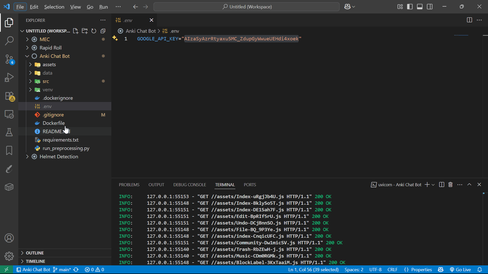

# Anki Chat Bot

An intelligent chatbot powered by RAG (Retrieval-Augmented Generation) that provides detailed answers about Anki, the popular flashcard application.

## 💡 Demo



## Features

- 🤖 Conversational AI interface for Anki-related questions
- 📚 Knowledge base built from Anki documentation and resources
- 🔍 Source citation for all answers
- 🌐 Modern web interface using Gradio
- ⚡ FastAPI backend with REST API support

## Setup

1. Install dependencies:
```bash
python -m venv venv
pip install -r requirements.txt
```

2. Set up your environment variables:
- Create a `.env` file
- Add your Google API key: `GOOGLE_API_KEY=your_api_key_here`

3. Run preprocessing to build the knowledge base:
```bash
python run_preprocessing.py
```

4. Start the application:
```bash
python src/main.py
```

The application will be available at:
- Web Interface: http://127.0.0.1:8000
- API Documentation: http://127.0.0.1:8000/docs

## Project Structure

- `src/main.py` - Main application entry point
- `src/rag_chain.py` - RAG implementation
- `src/gradio_ui.py` - Web interface
- `src/embedding.py` - Vector store management
- `src/data_loader.py` - Data processing utilities
- `src/crawl_data.py` - Web scraping utilities
- `src/config.py` - Configuration settings

## API Usage

Send POST requests to `/ask` endpoint:
```json
{
    "question": "Your question about Anki"
}
```